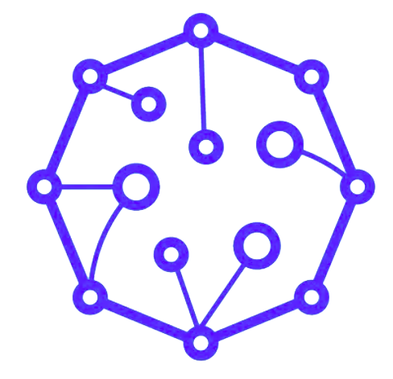
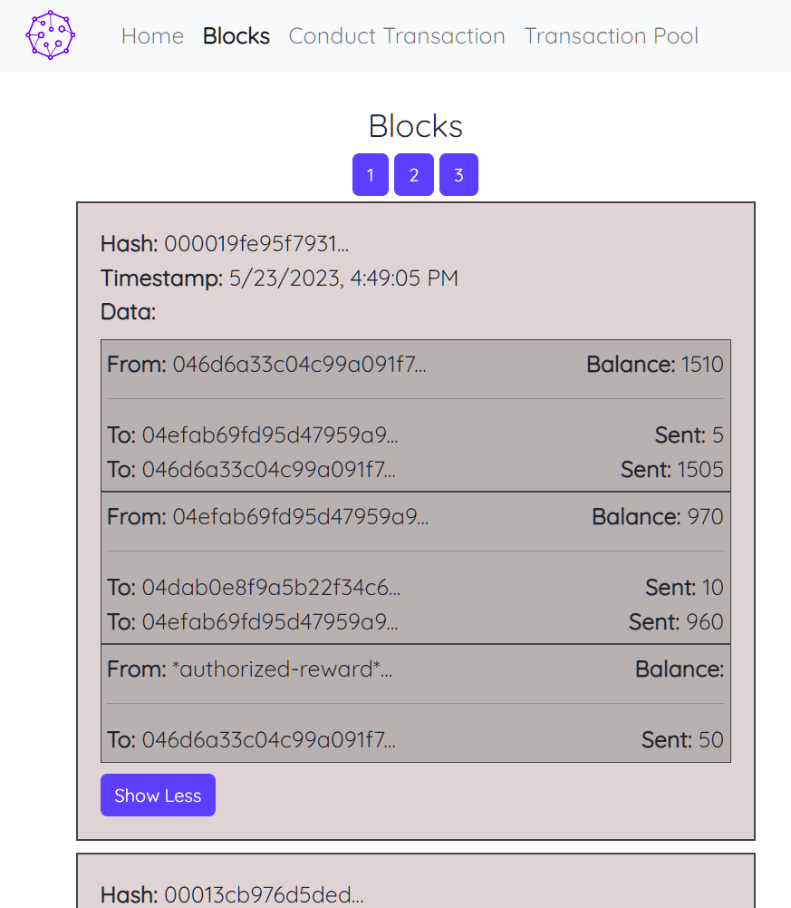

<!-- PROJECT LOGO -->

  <h1 align="center">Blockchain</h1>

  
 
    <a href="https://github.com/feliceforgione/medicineCabinet/issues">Report Bug</a>
    ·
    <a href="https://github.com/feliceforgione/medicineCabinet/issues">Request Feature</a>
  

<!-- ABOUT THE PROJECT -->
 

## About The Project

Blockchain programmed from scratch.  
Ability to create blockchain, create transactions, mine transactions from transaction pool, add blocks to block chain, verify transactions and blockchain

 
  
  

## Built With

|                                   |                                      |
| --------------------------------- | ------------------------------------ |
| [Node.js](https://nodejs.org/en/) | [React](https://react.dev/)          |
| [Redis](https://redis.io/)        | [Express.js](https://expressjs.com/) |
| [Docker](https://www.docker.com/) |                                      |

 

<!-- Usage -->

## Usage

`npm run dev` - To start development server  
`npm run dev-peer` - To add additional peer servers to the blockchain network

 

 
<!-- CONTACT -->

## Contact

Felice Forgione - [@forgione67](https://twitter.com/forgione67)

Project Link: [https://github.com/feliceforgione/blockchain-scratch](https://github.com/feliceforgione/blockchain-scratch)
